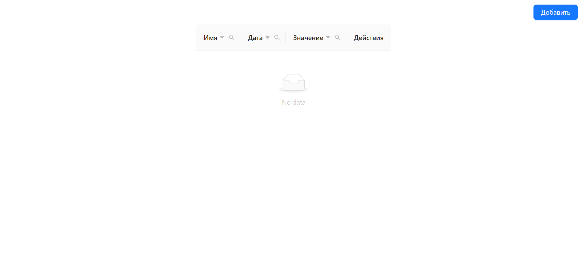

# Test task

**Вы также можете прочитать этот README на [русском](https://github.com/klekwedge/antd-table/blob/main/README.md)**

## Table of contents

- [Deployment instructions](#deployment-instructions)
- [Overview](#overview)
  - [Screenshot](#screenshot)
  - [Links](#links)
- [My process](#my-process)
  - [Built with](#built-with)
  - [What I learned](#what-i-learned)
- [Author](#author)

## Deployment instructions

**To run the project, you need to have [npm](https://nodejs.org/en/) and [git](https://git-scm.com/downloads) installed on your computer**

1. Make a clone of this repository ```git clone https://github.com/klekwedge/antd-table.git```
2. Install all required npm packages with ```npm i```
3. Run the project with the command ```npm run dev```

## Overview

Design a table component, with multiple columns. Columns should include a name, date, numeric value, and an action column. Above the table there should be an "Add" button that calls a modal window with a set of fields corresponding to the columns in the table. After filling in and validating these fields, a row with them should be added to the table.

- In the cell of the column "Actions" there should be buttons "delete" and "edit" (you can designate them with icons).
- Clicking on the "edit" button again calls up the modal window filled with data from the line and, when changed and confirmed in the modal window, changes the data in the corresponding line.
- Pressing the "delete" button removes the given line from the table.

To complete the test task, you must fulfill all the requirements above, while there are additional wishes that will be a plus when considering candidates:

- Use the AntD library, use it to implement sorting by all columns, which will work correctly depending on the type of value in the column
- If you decide not to use AntD, you can work on your own layout, add smooth animations for the modal window, think about adaptive.
- Implement search in all cells of the table. Place the search input above the table. When completing the task, it is allowed to use the AntD library (subject to additional requirements), as well as auxiliary libraries like lodash.

### Screenshot



### Links

- [Solution URL](https://github.com/klekwedge/antd-table)
- [Live Site URL](https://klekwedge-antd-table.vercel.app/)

## My process

### Built with

- React
- TypeScript
- Ant Design
- SCSS

### What I learned

## Author

- [Website](https://klekwedge-cv.vercel.app/)
- [Linkedin](https://www.linkedin.com/in/klekwedge/)
- [Facebook](https://www.facebook.com/klekwedge)

