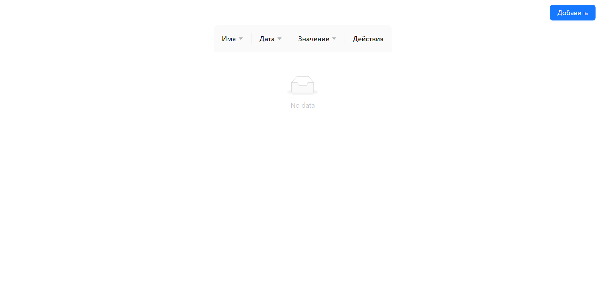

# Тестовое задание

**You can also read this README in [English](https://github.com/klekwedge/kaspel-test-task/blob/main/README.EN.md).**

## Оглавление

- [Инструкции по развертыванию](#инструкции-по-развертыванию)
- [Обзор](#обзор)
  - [Скриншот](#скриншот)
  - [Ссылки](#ссылки)
- [Мой процесс](#мой-процесс)
  - [Стек](#стек)
- [Автор](#автор)

## Инструкции по развертыванию

**Для запуска проекта на вашем компьютере должны быть установлены [npm](https://nodejs.org/en/) и [git](https://git-scm.com/downloads)**

1. Сделайте клон этого репозитория ```git clone https://github.com/klekwedge/kaspel-test-task.git```
2. Установите все необходимые пакеты npm с помощью ```npm i```
3. Запустите проект командой ```npm run dev```

## Обзор

Разработать компонент таблицы, с несколькими столбцами. Столбцы должны включать в себя имя, дату, числовое значение, а так же колонку с действиями. Над таблицей должна быть кнопка "Добавить", вызывающая модальное окно с набором полей соответствующих столбцам в таблице. После заполнения и валидации данных полей в таблицу должна добавляться строка с ними.

- В ячейке колонки "Действия" должны быть кнопки "удалить" и "редактировать" (можете обозначать их иконками).
- Нажатие на кнопку "редактировать" вновь вызывает модальное окно, заполненное данными из строки и при изменении и подтверждении в модальном окне меняет данные в соответствующей строке.
- Нажатие на кнопку "удалить" - убирает данную строку из таблицы.

Для выполнения тестового задания необходимо выполнить все требования выше, при этом есть дополнительные пожелания, которые будут плюсом при рассмотрении кандидатов:

- Использовать библиотеку AntD, реализовать с её помощью сортировку по всем колонкам, которая будет правильно работать в зависимости от типа значения в колонке
- Если решите не использовать AntD, можете поработать над собственной версткой, добавить плавных анимаций для модального окна, подумать над адаптивом.
- Реализовать поиск по всем ячейкам таблицы. Инпут для поиска расположить над таблицей.  При выполнении задания разрешается пользоваться библиотекой AntD (при условии выполнения дополнительных требований), а так же вспомогательных библиотек по типу lodash.

### Скриншот



### Ссылки

- [Ссылка на проект](https://github.com/klekwedge/kaspel-test-task)
- [Деплой](https://klekwedge-kaspel-test-task.vercel.app/)

## Мой процесс

### Стек

- React
- TypeScript
- Ant Design
- SCSS

## Автор

- [Вебсайт](https://klekwedge-cv.vercel.app/)
- [Linkedin](https://www.linkedin.com/in/klekwedge/)
- [Facebook](https://www.facebook.com/klekwedge)
